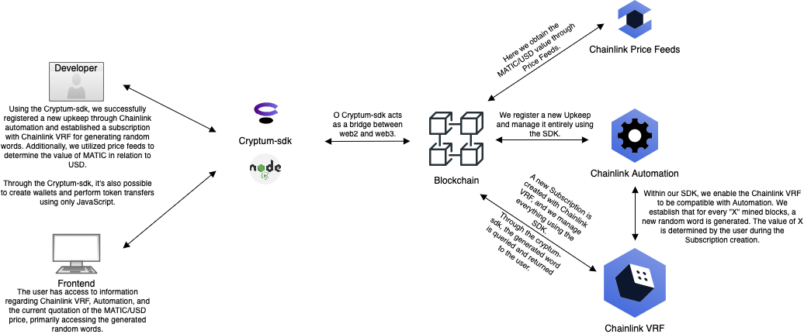

# About The Project

This code provides a practical example of how to use the Chainlink functions implemented with the [Cryptum-sdk](https://github.com/cryptum-official/cryptum-sdk)

In this project, we utilized the following functionalities:

- Price Feeds
- VRF
- Automation

This project was developed based on the POLYGON network on TESTNET.

It's necessary to have MATIC and at least 20 LINK in your wallet for it to function correctly.

The game generates random numbers every 100 generated blocks.

The player must define a sequence of 10 numbers; if the player matches 6 numbers or more, they will win a reward. If they match fewer than 6, the player will pay the game's admin.

## About Cryptum

The Cryptum infrastructure allows clients to integrate and interact with the most diverse blockchain protocols - you don't need to start from scratch! We already laid the foundation for you to build upon. </b> Learn more about Cryptum <a href="https://cryptum.io" target="_blank">here</a>.


## About Chainlink

Chainlink is the industry-standard Web3 services platform that has enabled trillions of dollars in transaction volume across DeFi, insurance, gaming, NFTs, and other major industries. As the leading decentralized oracle network, Chainlink enables developers to build feature-rich Web3 applications with seamless access to real-world data and off-chain computation across any blockchain and provides global enterprises with a universal gateway to all blockchains.

[Read more about the Chainlink integration](docs/chainlink.md).

## Architecture



---

Using the cryptum-sdk, we are able to natively implement Chainlink functionalities. In this project, we employed the cryptum-sdk to create and manage features such as Price Feeds, VRF, and Automation.

The cryptum-sdk already has the Chainlink VRF functionality configured to be compatible with Chainlink Automation. When creating the VRF, you can pass the parameter "updateIntervalUpkeep," which determines the interval in blocks for generating a new random word.

After the VRF is created, we register our Upkeep by specifying the address of the previously created VRF contract as the destination.

Now, every "X" blocks, a new random word is generated, where "X" represents the value passed in the "updateIntervalUpkeep" parameter. You can track all requests and generated words, as well as monitor the balance and other information related to VRF and Automation using the cryptum-sdk.

Additionally, in this project, we also used Price Feeds to quote the value of MATIC / USD.

### Implementation

The following steps showcase the core aspect of our project, which involves creating VRF combined with Chainlink Automation using the cryptum-sdk to generate random words every 100 mined blocks on the POLYGON - MUMBAI network.

#### step 1

With a valid Cryptum API Key, you can then instantiate the SDK as follows:

[Create account Dashboard Cryptum](https://github.com/cryptum-official/cryptum-sdk/tree/master#first-steps)

```js
const CryptumSdk = require('cryptum-sdk')

const sdk = new CryptumSdk({
  environment: 'testnet',  // 'testnet', 'mainnet'
  apiKey: "YOUR-API-KEY-HERE",
})
```

>Implementation example in: [cryptum-lottery/service/Cryptum.js](https://github.com/Madureiradaniel/cryptum-lottery/blob/master/service/Cryptum.js)

#### step 2

Then you call the generateWallet() function passing the protocol you want:

```js
const wallet = await sdk.wallet.generateWallet({ protocol: 'POLYGON' })

```
>Implementation example in: [cryptum-lottery/controller/Wallet.js](https://github.com/Madureiradaniel/cryptum-lottery/blob/master/controller/Wallet.js)

#### step 3

Add faucets to your new wallet.

MATIC and LINK as described in: [Faucets](#faucets)


#### step 4

Create Subscription Chainlink VRF.

```js
const { hash } = await sdk.chainlink.createVRF({
    protocol,
    wallet,
    updateIntervalUpkeep: num_blocks_interval
    // Block interval, the new random word will be generated at each defined interval
})

const { contractAddress } = await sdk.transaction.getTransactionReceiptByHash({
    protocol,
    hash
})

return contractAddress
```

>Implementation example in: [cryptum-lottery/controller/Lottery.js](https://github.com/Madureiradaniel/cryptum-lottery/blob/master/controller/Lottery.js)

#### step 5

Add Funds with LINK in your Subscription.

```js
const { hash } = await sdk.chainlink.topUpVRF({
    protocol,
    address, // contract address generated in step 4
    wallet,
    amount: 10
})
```

#### step 6

Automation setup; this stage is where we create the process responsible for generating a new random word every 'N' blocks.

```js
const { hash } = await sdk.chainlink.createAutomation({
    protocol,
    wallet
})

const { contractAddress } = await sdk.transaction.getTransactionReceiptByHash({
    protocol,
    hash
})

return contractAddress
```
>Implementation example in: [cryptum-lottery/controller/Lottery.js](https://github.com/Madureiradaniel/cryptum-lottery/blob/master/controller/Lottery.js)

#### step 7

Add Funds with LINK in your Automation.

Perform a transfer of LINKs from your wallet to the contract address generated in step 6.

```js
const { hash } = await sdk.token.transfer({
    protocol,
    amount,
    wallet,
    token: LINK_TOKEN_POLYGON_MUMBAI, // 0x326C977E6efc84E512bB9C30f76E30c160eD06FB
    destination: contractAddress // contract address generated in step 6
})
```
>Implementation example in: [cryptum-lottery/controller/Lottery.js](https://github.com/Madureiradaniel/cryptum-lottery/blob/master/controller/Lottery.js)

#### step 8

Register Upkeep.

At this stage, we will register our automation, initiating the process so that new random words are generated after every N number of blocks mined on the blockchain.

```js
const { hash } = await sdk.chainlink.registerUpkeep({
        protocol,
        wallet,
        address: upkeepContract, // contract address generated in step 6
        name: 'Cryptum Random Words',
        encryptedEmail: '0x',
        upkeepContract: subscriptionContract, // contract address generated in step 4
        gasLimit: 500000,
        triggerType: 0,
        checkData: '0x',
        triggerConfig: '0x',
        offchainConfig: '0x',
        amount: '10' // lINK
})
```

>Implementation example in: [cryptum-lottery/controller/Lottery.js](https://github.com/Madureiradaniel/cryptum-lottery/blob/master/controller/Lottery.js)

#### step 9

Getting the generated random words.

Get the last request ID generated in your subscription:

```js
const latestRequestID = await sdk.chainlink.latestRequestVRF({
    protocol,
    address // contract address generated in step 4
})

const randomWords = await sdk.chainlink.getRandomWordsVRF({
        protocol,
        address, // contract address generated in step 4
        requestId // latestRequestID
})

/*
Ex. Response:
{
    fulfilled: true,
    randomWords: [ "123456.....891011"]
}

*/
```

>Implementation example in: [cryptum-lottery/cron/index.js](https://github.com/Madureiradaniel/cryptum-lottery/blob/master/cron/index.js)

#### step 10

Getting information about your subscription and automation:

```js
const subscription = await sdk.chainlink.getSubscriptionVRF({
    protocol,
    address // contract address generated in step 4
})
```

List all upkeeps

```js
const upkeeps = await sdk.chainlink.listUpkeeps({
    protocol,
    address // contract address generated in step 6
})

```
Get info Upkeep ID:

```js
const upkeep = await sdk.chainlink.getUpkeep({
    protocol,
    upkeepID
})
```
>Implementation example in: [cryptum-lottery/controller/Lottery.js](https://github.com/Madureiradaniel/cryptum-lottery/blob/master/controller/Lottery.js)

## Playground

Use this playground to simulate bets and observe the functionality of Chainlink VRF generating random numbers every 100 mined blocks on the POLYGON network - MUMBAI.

https://lottery.danielmadureira.dev

Provide your email and start playing.

If the game is paused, you can press to initiate the number generation.

## Faucets

- MATIC - https://mumbaifaucet.com/
- LINK - https://faucets.chain.link/mumbai


### Requirements

- Docker
- docker-compose

### Run

```bash
docker-compose up --build
```

### START LOTTERY

"Access the documentation through Postman:

[](https://app.getpostman.com/run-collection/7996144-0ad56245-2d6a-4172-a984-84ace10a9436?action=collection%2Ffork&source=rip_markdown&collection-url=entityId%3D7996144-0ad56245-2d6a-4172-a984-84ace10a9436%26entityType%3Dcollection%26workspaceId%3Da00e2d23-653b-41f5-a0fa-236b846175c2#?env%5BLottery%5D=W3sia2V5IjoiaG9zdCIsInZhbHVlIjoibG9jYWxob3N0OjgwODAiLCJlbmFibGVkIjp0cnVlLCJ0eXBlIjoiZGVmYXVsdCJ9XQ==)

Follow these steps to create a new game:

- Create Lottery (POST | /lottery/create)

- Create Subscription (POST | /lottery/subscription)

- Create Automation (POST | /lottery/automation)

- Register Upkeep ( POST | /lottery/registerUpkeep)